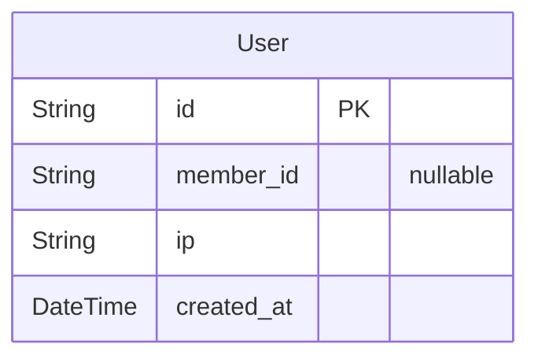
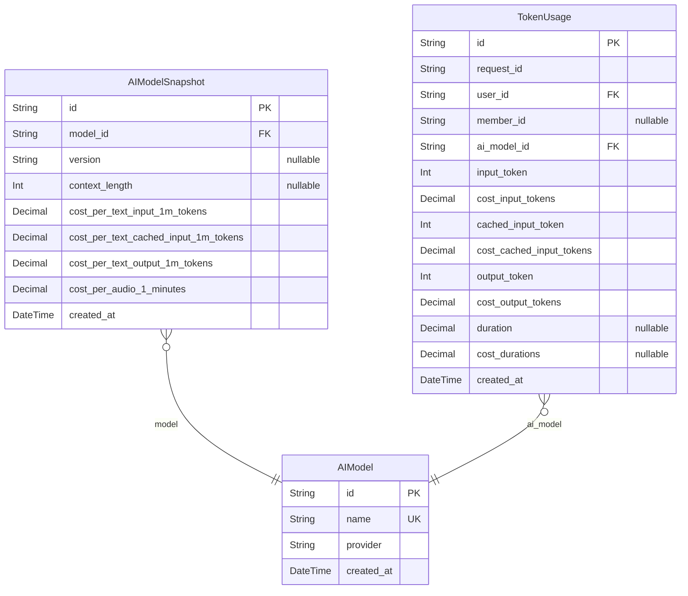
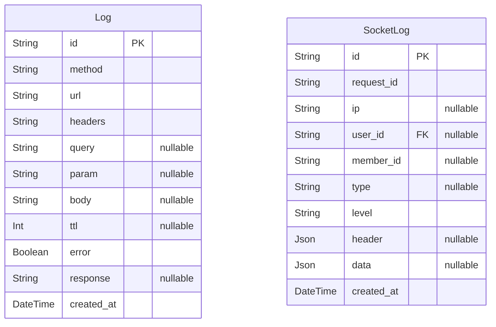
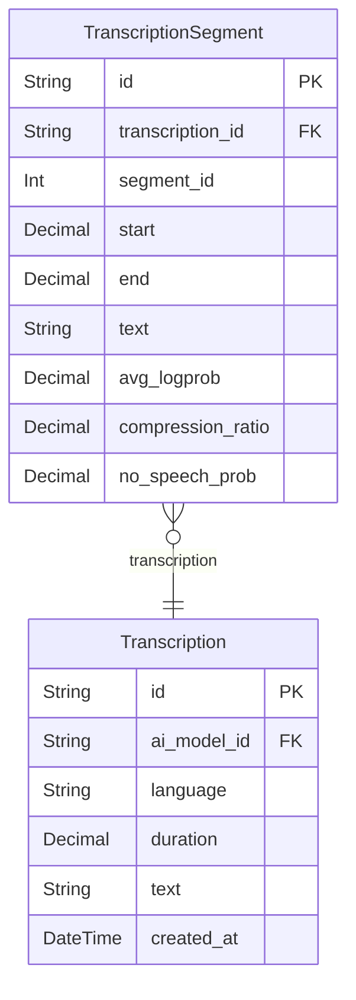
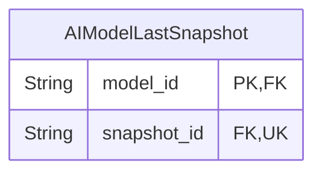

# Web Socket Practice

> Generated by [`prisma-markdown`](https://github.com/samchon/prisma-markdown)

- [Actor](#actor)
- [AI-Model](#ai-model)
- [Log](#log)
- [Transcription](#transcription)
- [default](#default)

## Actor

### `User`

사용자.

Properties as follows:

- `id`: PK
- `member_id`: 회원 아이디
- `ip`: IP 주소
- `created_at`: 데이터 생성 날짜

## AI-Model

### `AIModel`

AI 모델 정보.

Properties as follows:

- `id`: PK. 아이디
- `name`: 모델 이름 (예: gpt-4o)
- `provider`: 모델 제공자 (예: OpenAI)
- `created_at`: 모델 등록 시간

### `AIModelSnapshot`

AI 모델 스냅샷

모델 추가시 수기로 아래 내용을 기입해야한다.

Properties as follows:

- `id`: PK. 스냅샷 아이디
- `model_id`: [AI모델](#AIModel)의 아이디
- `version`
  > 모델 버전 (예: 4o)
  >
  > null인 경우는 모른다 / 혹은 지정하지 않은 것을 의미
- `context_length`: 최대 지원 토큰 길이 (예: 128000)
- `cost_per_text_input_1m_tokens`
  > 입력 토큰당 텍스트 비용 (USD)
  >
  > 음성 파일의 경우에도 프롬프트를 넣을 수 있기 때문에 0의 값이 아닐 수 있다.
- `cost_per_text_cached_input_1m_tokens`
  > 캐시된 입력 토큰당 텍스트 비용 (USD)
  >
  > 음성 파일의 경우에도 프롬프트를 넣을 수 있기 때문에 0의 값이 아닐 수 있다.
- `cost_per_text_output_1m_tokens`: 출력 토큰당 텍스트 비용 (USD)
- `cost_per_audio_1_minutes`: 1분 당 비용 (USD)
- `created_at`: 스냅샷 생성날짜

### `TokenUsage`

토큰 사용량 및 비용

Properties as follows:

- `id`: PK. 아이디
- `request_id`
  > 요청 아이디
  > 하나의 API 요청 또는 하나의 소켓 요청은 동일한 request_id를 가진다.
  >
  > 비용을 추적하기 용이하게 하기 위한 목적으로 추가.
- `user_id`: FK. 유저 ID
- `member_id`: FK. 사용한 멤버 ID
- `ai_model_id`
  > FK. 모델 아이디
  >
  > 사용한 모델
- `input_token`: Input 토큰 사용량
- `cost_input_tokens`: Input 토큰 비용 (USD)
- `cached_input_token`: Cached Input 토큰 사용량
- `cost_cached_input_tokens`: Cached Input 토큰 비용 (USD)
- `output_token`: Output 토큰 사용량
- `cost_output_tokens`: Output 토큰 비용 (USD)
- `duration`: 오디오 모델을 사용한 경우, 사용한 오디오 음성 길이
- `cost_durations`: Output 토큰 비용 (USD)
- `created_at`: 생성 시점

## Log

### `Log`

로그 테이블

Properties as follows:

- `id`: PK 아이디
- `method`
  > HTTP 메서드
  >
  > 'GET' | 'POST' | 'PUT' | 'PATCH' | 'DELETE'
- `url`
  > 요청 url
  >
  > request path
- `headers`
  > 요청 헤더
  >
  > req.headers
- `query`
  > 요청 쿼리
  >
  > req.query
- `param`
  > 요청 파라미터
  >
  > req.params
- `body`
  > 요청 바디
  >
  > req.body
- `ttl`
  > ttl
  >
  > ms 단위, 해당 요청에 대한 요청부터 응답까지의 시간.
  > 값이 null이면 서버가 응답을 하지 않고 장애가 발생한 것.
- `error`
  > 에러 발생 여부
  >
  > ture면 에러로 판단.
- `response`
  > 응답 값
  >
  > 에러 발생시 에러 내용이 담긴다.
- `created_at`
  > 요청이 생성된 시간
  >
  > 응답 시간은 해당 칼럼에 ttl을 더함으로써 알 수 있다.

### `SocketLog`

소켓 로그

Properties as follows:

- `id`: PK 아이디
- `request_id`
  > 요청 아이디
  >
  > 한 번의 소켓 요청에 대해서는 동일한 request_id를 가져야 한다.
- `ip`: 아이피 주소
- `user_id`: 유저 아이디
- `member_id`: 멤버 아이디
- `type`: 소켓  타입
- `level`
  > 로그 레벨
  >
  > log, debug, warn, error, fatal 5단계를 둔다.
  >
  > - log: 단순 로그
  > - debug: 디버그 로그
  > - warn: 경고
  > - error: 에러 발생
  > - fatal: 소켓 다운
- `header`: 소켓 요청 헤더
- `data`: 로그를 남길 데이터
- `created_at`: 로그 생성 시점

## Transcription

### `Transcription`

STT Transcription

Properties as follows:

- `id`: PK. 아이디
- `ai_model_id`: FK. AI Model 아이디
- `language`: 인식된 응답 언어의 코드 (예: "en", "ko" 등)
- `duration`: 오디오 전체 길이(초).
- `text`: 전체 텍스트
- `created_at`: 데이터 저장 시간

### `TranscriptionSegment`

STT Transcription

Properties as follows:

- `id`: PK. 아이디
- `transcription_id`: FK. Transcription 아이디
- `segment_id`
  > 세그먼트 아이디
  >
  > whisper응답에서 오는 segment id
- `start`: 세그먼트 시간 시간 (초)
- `end`: 세그먼트 종료 시간 (초)
- `text`: 텍스트
- `avg_logprob`
  > 신뢰도 (세그먼트내 로그 평균)
  >
  > 0에 가까울수록 신뢰값
- `compression_ratio`
  > 압축 비율 (값이 클수록 텍스트에 반복이 많다는 신호)
  >
  > 의미 없는 반복 출력(환각)에 민감.
- `no_speech_prob`: 무음일 확률

## default

### `AIModelLastSnapshot`

모델 마지막 스냅샷

Properties as follows:

- `model_id`: [AI모델](#AIModel)의 아이디
- `snapshot_id`: [AI모델 스냅샷](#AIModelSnapshot)의 아이디
